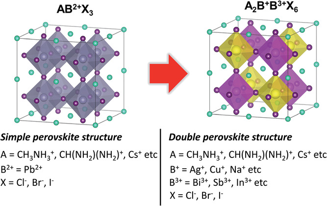

# Double Perovskite Neuronal Network Classification

The discussed algorithm aims to use a machine learning prediction strategies to fuide the development of high, stable and efficient performing double perovksite solar cells. In order to optimize the material composition, develop design strategies, and predict the performance of DPSCs.

## Getting Started

These instructions will get you a copy of the project up and running on your local machine for development and testing purposes. See deployment for notes on how to deploy the project on a live system.

### Prerequisites

The list of software or packages that are used in the script and that you may need before using it.

* Python latest version
* Pip - to install the packages
* Pandas
* Numpy
* Matplotlib
* Scipy
* Mendeleev
* Sklearn
* Keras
* Helvetios - cluster to perform the training

### Introduction
Perovskite are materials having a crystal structure similar to the mineral called perovskite, calcium titatium oxide (CaTiO3). The general formula of perovskite compounds is ABX3. Where 'A', 'B' are cations of different sizes, with A being the biggest of the two and 'X' is an anion most frequently oxide. It is one of the most abundant structural families, they are found in an normous number of compounds with wide-ranging properties, applications and importance.

In this project the double perovskite like structure is investigated. It is similar to single perovskite except that the unit cell is twice of perovskite. With similar architecture of 12 coordinate A sites and 6 coordinate B sites, but two cations are ordered on the B site and the general structure is thus the following: A2BB'X6 with X being halides or oxide. As you will see later there are many possibilites of double perovskite structure, thus thousands of possibile solar cells possibilities.




Perovskite solar cell is a type of solar cell which incorporate a material with a perovkiste-structure compound as the light-harvesting active layer. In general they are cheap to produce and simple to manufacture. In addition, from its beggining in 2009 the efficiencies of such device has increase from 3.8% to 29.15% recently. This exceeds the maximum efficiency achieved in a single-junction silicon solar cell. This is why they are placed as the fastest-advancing solar technology nowadays. This combined to their commerciale attractivness due to low production costs, perovskite solar cell researchs are published every day.

But imagine trying the thousands of hundreds of double perovskite like material as solar cell. It will cost to much in R&d and it is time consuming. This is where Machine Learning comes into scene. By training a Neural Network one could build a tool to first recognize what materials have double perovskite structure. Then many other different prospects are conceivable from such NN.

From the Inorganic Crystal Structure Database (ISCD) two double perovskite like material parsed database was generated, halide perovskite and oxygen perovskite. The following ANX formula 'abc2x6' was used on ICSD to query every crystal with such structure. Also the temperature and pression of the experiment was set to 273-313 K and 0.101325 MPa (NTP).

After some manipulation and Data Cleaning these databases are used in the Neuronal-Network. The main aim of Data Cleaning is to identify and remove errors & duplicate data, in order to create a reliable dataset. This improves the quality of the training data for analytics and enables accurate decision-making. The parsed dataframe of halides is not usefull. Indeed, they are only five perovskite like structure out of 144 in the whole dataframe and it is not enough to be used in a NN. However, one should notes that they may be some experiments where the researchers did not investigate enough and did not label the structure as perovskite on ICSD. In opposition, the oxide dataframe has enough data and enough labelled perovskite to be used in the algorithm.

In a first instance, I tried to use the package SickitLearn to perform the classification as I was more confortable with it, the results can be found in the Sickit-Learn subsection.

The package SickitLearn is the simplest one to use in the possible ML packages, it also offers a wide range of possibilites. However, the hyperparameters characterization is not enough modular and versatile. Besides it does not give the possibility to perform a !!!!!!!word!!!!!!!. That is the reasons I switched to the Keras library to perform my NN.

### Code

#### ICSD - Halide
First open the text file queried on ICSD.
```
df = pd.DataFrame(pd.read_table("ICSD-halides.txt"))
df.rename(columns = {"Unnamed: 4": "Perovskite_label"},  
          inplace = True)
#df = df.rename(columns = lambda x: x+':')
df['Perovskite_label']=0
df.fillna('-',inplace = True)
#df
```
Labelling the perovskites.
```
for l in range(len(df)):
    if 'Perovskite' in df.StructureType[l] or "perovskite" in df.StructureType:
        df.Perovskite_label[l] = 1
```
Get rid of duplicate, polymorpishm and get rid of complex so stochiometric are only integers.
```
a = []
for l in range(len(df)):
    if '.' in df.StructuredFormula[l]:
        a.append(l)
df_complex = df.drop(a, axis=0)
df_complex.sort_values(by=['Perovskite_label'], ascending=False, inplace=True)
df_complex.reset_index(drop=True, inplace=True)
```
Extraction as excel file
```
df_complex_multiplicate.to_csv('Parsed-halides.csv', columns = ['StructuredFormula', 'Perovskite_label'], index=False)
```
Dataframe with only five perovskites
```
StructuredFormula,Perovskite_label
Na Ba Li Ni F6,1
Na2 Li (Al F6),1
Li Na2 (Al F6),1
K2 Li (Al F6),1
Rb2 K Y F6,1
Rb2 Na Y F6,0
Cs2 Na Y F6,0
K2 Na Tl F6,0
K2 Na Y F6,0
```

#### ICSD - Oxide
The procedure code is similar than for the halide part, please refer to the code directly for further information. There are 382 perovskites out of 583 structures.

First of all the following dataframe is used for to train the NN, with four features and one label.
```
	Atom1	Atom2	Atom3	Atom4	Perovskite_label
0	Y	Ni	Mn	O	1
1	Ba	La	Ru	O	1
2	Sr	Ho	Mo	O	1
3	Sr	Dy	Mo	O	1
4	Sr	Gd	Mo	O	1
...	...	...	...	...	...
579	Na	Cr	Ge	O	0
580	K	Gd	Si	O	0
581	Li	La	C	O	0
582	La	Zn	Ti	O	0
583	Rb	U	Si	O	0
```
One can withdraw the fourth label since it is always an oxygen atom for every crystal structure. Also note that the dataset is a bit biased to the label 1 thus the loss should be weighted

#### Sickit-Learn
Because of the size of the data collections, no validation set are used and the train/test set is split as 70/30. Data is also normalized in order be used in the training, I decided to choose a absolute maximum scaling.
```
X = Features[:,0:4]
y = Features[:,-1].astype('int')
X_train, X_test, y_train, y_test = train_test_split(X, y, stratify=y,
                                                    random_state=21)
sklearn.preprocessing.normalize(X, norm='l1', *, axis=1, copy=True, return_norm=False)
max_abs_scaler = preprocessing.MaxAbsScaler()
X_train = max_abs_scaler.fit_transform(X_train)
```

The best hyperparameters found for the classification are the following: 
* max_iter=360 - It was the first hyperparameter investigated with a dummy NN. A simple plot comparing the number of epoch to the score was made to choose the best number of epochs.
* activation='relu' - Most used activation so far and does the job perfectly well.
* solver='lbfgs' - The most appropriate solver so far in accordance to publications.
* alpha=1e-5 - Seems to be in between overfitting and underfitting after trials.
* hidden_layer_sizes=(100,150,50) - Performed many trials and seems to yield the optimal value.
** The number of hidden neurons should be between the size of the input layer and the size of the output layer.
** The number of hidden neurons should be 2/3 the size of the input layer, plus the size of the output layer.
** The number of hidden neurons should be less than twice the size of the input layer.
* learning_rate='adaptive' - Again the most appropriate in accordance to the argument.
Most of the tuning rely on intuitions, testings and previous academic researchs.

```
clf = MLPClassifier(random_state=11, max_iter=360, activation='relu', solver='lbfgs', alpha=1e-5, hidden_layer_sizes=(100,150,50),learning_rate='adaptive').fit(X_train, y_train)
clf.predict_proba(X_test[:1])
clf.predict(X_test[:, :])
clf.score(X_test, y_test)
```


#### Keras


#### Ionic Radius


#### Further Development


#### Conclusion


PS: next time listen to the PhD and start with Keras straight away.


## Deployment

In order to deploy this on your own system, you must have your ICSD database or you can use the one used in this project.

## Contributing

There are no contribution for this project.

## Versioning

There is only one version available and you may develop your own. 

## Authors

* **Amin Debabeche** - *EPFL* - Molecular Engineering of Functional Materials Lab

## License

This project is licensed under the MIT License - see the [LICENSE.md](LICENSE.md) file for details

## Acknowledgments

* PhD Assistant: Alexander Federovskiy
* Inspiration
* etc

## Bibliography
Please find here a brief list of useful links or papers that could be used or that I personnaly used.

https://www.google.com/search?client=safari&rls=en&ei=P0vSX5HFKsPVkgXH-Y-ABw&q=callback+keras&oq=callback+keras&gs_lcp=CgZwc3ktYWIQAzIECAAQEzIECAAQEzIECAAQEzIECAAQEzIGCAAQHhATMgYIABAeEBMyBggAEB4QEzIGCAAQHhATMgYIABAeEBMyBggAEB4QEzoECAAQR1CcFVicFWCrGWgAcAJ4AIABV4gBV5IBATGYAQCgAQGqAQdnd3Mtd2l6yAEIwAEB&sclient=psy-ab&ved=0ahUKEwjR4NKl6cPtAhXDqqQKHcf8A3AQ4dUDCAw&uact=5

https://www.google.com/search?q=optimizer+keras+gif&client=safari&rls=en&source=lnms&tbm=isch&sa=X&ved=2ahUKEwicifed5cPtAhURDOwKHbrCAB8Q_AUoAXoECA8QAw&biw=1280&bih=660#imgrc=6Hh6z6leHFImuM

https://www.google.com/search?client=safari&rls=en&q=keras+tuner&ie=UTF-8&oe=UTF-8

https://www.dlology.com/blog/quick-notes-on-how-to-choose-optimizer-in-keras/

https://c4science.ch/source/perovclass/browse/master/networks/ABX3%2BABO3%20n/ABX3%2BABO3_n.py
